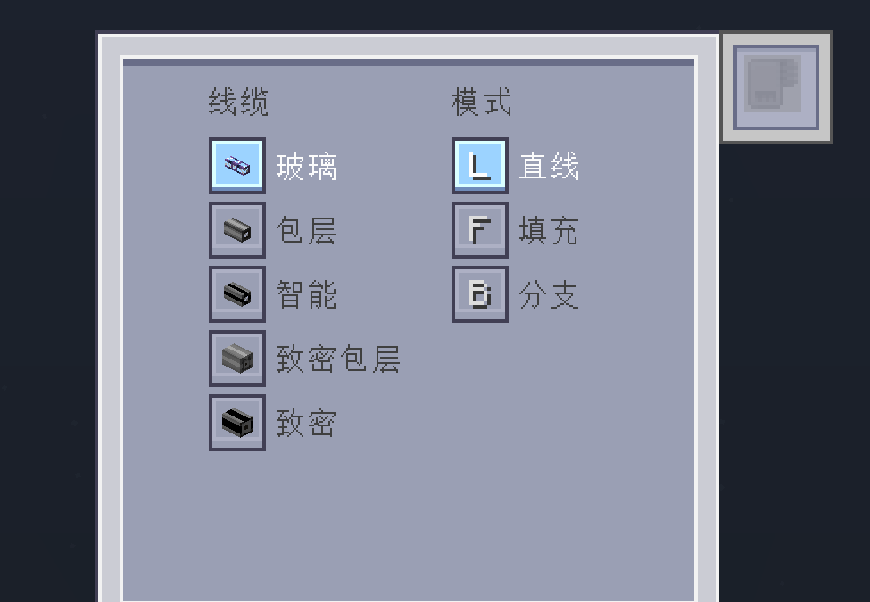
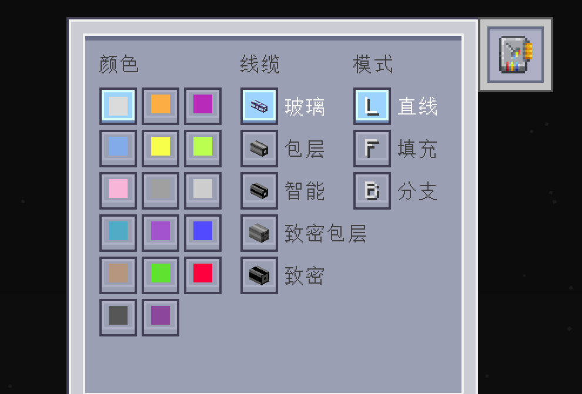

---
navigation:
  parent: introduction/index.md
  title: ME Cable Placement Tool
  position: 3
  icon: meplacementtool:me_cable_placement_tool
categories:
  - meplacementtool tools
item_ids:
  - meplacementtool:me_cable_placement_tool
---

# ME Cable Placement Tool

<ItemImage id="meplacementtool:me_cable_placement_tool" scale="4" />

The ME Cable Placement Tool is designed for rapid cabling, supporting various cable types and colors with multiple placement modes.

## Features

- **Multiple Cable Types**: Supports Glass, Covered, Smart, Dense Covered, and Dense Smart cables
- **Multiple Placement Modes**:
  - **Line Mode**: Quickly lay straight lines of cables
  - **Plane Fill**: Lay a cable network within a rectangular area
  - **Plane Branching**: Create a tree-like branching structure of cables
- **Network Integration**: Connects to your ME network via <ItemLink id="ae2:wireless_access_point" />
- **Undo Support**: Supports undoing recent placement operations

## Usage Guide

- **Right-click**: Select coordinates
- **Left-click**: Cancel coordinate selection
- **Press G**: Open configuration GUI
- **Hold Ctrl + Left-click with tool**: Undo last placement operation
- **Place tool in ME Wireless Access Point**: Link to ME network

### Without Key of Spectrum

- **Manual Dyeing**: If holding dye in off-hand, it will consume dye to color the placed cables automatically

### With Key of Spectrum

- **Color Selection**: Freely select any of the 16 colors in the configuration GUI
- **Automatic Dyeing**: Placed cables will automatically become the selected color without consuming dye
- **Press A**: Favorite the currently selected color (can be modified in key bindings)

## Recipe

<RecipeFor id="meplacementtool:me_cable_placement_tool" />
