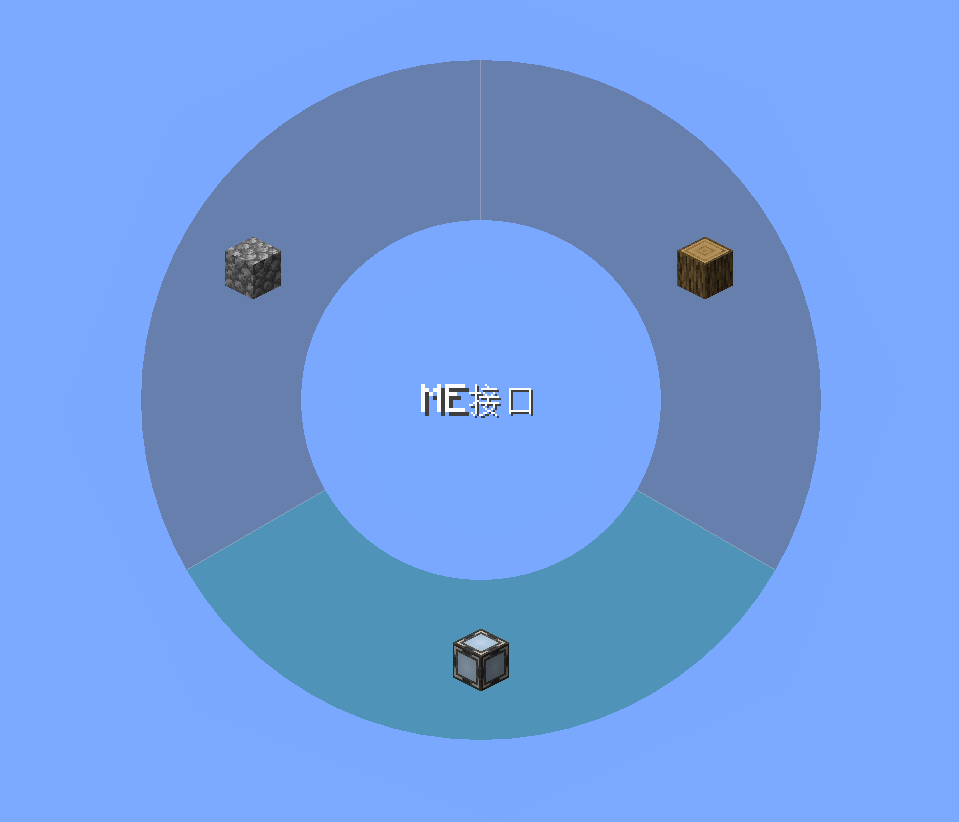
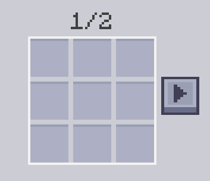

---
navigation:
  parent: introduction/index.md
  title: ME Placement Tool
  position: 1
  icon: meplacementtool:me_placement_tool
categories:
  - meplacementtool tools
item_ids:
  - meplacementtool:me_placement_tool
---

# ME Placement Tool

<ItemImage id="meplacementtool:me_placement_tool" scale="4" />

The ME Placement Tool is a powerful ME network integration tool that allows you to place blocks, AE2 cable parts and fluids directly from the ME network, with support for configuring up to 18 different target items or fluids.

## Features

- **Wireless Placement**: Place blocks and parts without carrying them in your inventory
- **Network Integration**: Connects to your ME network via <ItemLink id="ae2:wireless_access_point" />
- **18 Configuration Slots**: Configure up to 18 different items or fluids for quick switching
- **Auto-Crafting**: If an item is not available but craftable, opens the crafting request menu
- **Memory Card Support**: When holding <ItemLink id="ae2:memory_card" /> in off-hand, automatically apply its settings when placing devices
- **Mekanism Configuration Card Support**: When holding Mekanism Configuration Card in off-hand, automatically apply its settings when placing devices

## Usage Guide

- **Right-click with tool (in air)**: Open configuration GUI
- **Right-click with tool (on block)**: Place block
- **Hold G**: Open radial menu
- **Left-click in radial menu**: Select item

## Network Connection

Place the tool into a <ItemLink id="ae2:wireless_access_point" />: Link to ME network

## Configuration GUI

The configuration GUI has 18 slots where you can set items to place:
- Drag items from JEI/REI to set them as targets
- Drag items from your inventory to set them as targets
- Configure both blocks and AE2 parts (cables, buses, panels, etc.)

## Recipe

<RecipeFor id="meplacementtool:me_placement_tool" />
